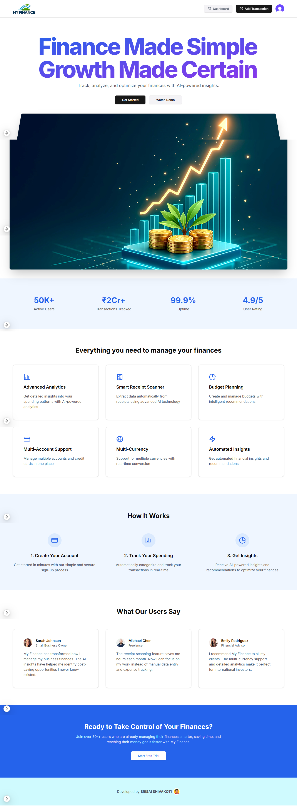

# 💸 MY FINANCE

A full-stack AI-powered personal finance management platform built with Next.js, Supabase, Prisma, Tailwind CSS, Inngest, ArcJet, Resend, and ShadCN UI.



This application enables users to:

* Manage multiple bank accounts
* Track income and expenses
* Scan receipts using AI (Gemini API)
* Receive automated monthly financial reports with AI-generated insights
* Categorize transactions intelligently
* Set budgets and receive alerts
* Visualize financial data through interactive charts
* Handle recurring transactions
* Authenticate via Clerk (Email/Password or Google)
* Implement rate limiting and security with ArcJet

## 🛠️ Tech Stack

* **Frontend**: Next.js 15, React 19, Tailwind CSS, ShadCN UI
* **Backend**: Supabase (PostgreSQL), Prisma ORM
* **Authentication**: Clerk
* **AI Integration**: Google Gemini API
* **Email Notifications**: Resend
* **Background Jobs**: Inngest
* **Rate Limiting & Security**: ArcJet
* **Deployment**: Vercel

## 🚀 Features

* **Multi-Account Management**: Link and manage multiple bank accounts.
* **AI Receipt Scanning**: Upload receipts to extract transaction details using the Gemini API.
* **Automated Monthly Reports**: Receive monthly emails with AI-generated financial insights.
* **Smart Categorization**: Automatically categorize transactions into predefined categories.
* **Budget Tracking**: Set spending limits and receive alerts when approaching them.
* **Interactive Dashboards**: Visualize income, expenses, and savings through charts.
* **Recurring Transactions**: Manage and track recurring expenses and incomes.
* **Secure Authentication**: Authenticate users securely using Clerk.
* **Rate Limiting**: Protect APIs from abuse using ArcJet.

## 📂 Project Structure

```bash
├── app/                 # Next.js app directory
├── components/          # Reusable UI components
├── data/                # Static data and constants
├── emails/              # Email templates
├── hooks/               # Custom React hooks
├── lib/                 # Utility functions and libraries
├── prisma/              # Prisma schema and migrations
├── public/              # Public assets
├── styles/              # Global styles
├── .env.example         # Environment variable examples
├── next.config.js       # Next.js configuration
├── tailwind.config.js   # Tailwind CSS configuration
└── package.json         # Project dependencies and scripts
```

## ⚙️ Environment Variables

Create a `.env` file in the root directory and add the following variables:

```env
NEXT_PUBLIC_CLERK_PUBLISHABLE_KEY=
CLERK_SECRET_KEY=

NEXT_PUBLIC_CLERK_SIGN_IN_URL =
NEXT_PUBLIC_CLERK_SIGN_UP_URL =

# Connect to Supabase via connection pooling.
DATABASE_URL=

# Direct connection to the database. Used for migrations.
DIRECT_URL=

ARCJET_KEY=

RESEND_API_KEY =

GEMINI_API_KEY =
```

## 🧑‍💻 Getting Started

1. **Clone the repository**:

   ```bash
   git clone https://github.com/Srisai16/MY_FINANCE.git
   ```

2. **Install dependencies**:

   ```bash
   npm install
   # or
   yarn install
   ```

3. **Set up the database**:

   ```bash
   npx prisma migrate dev --name init
   ```

4. **Run the development server**:

   ```bash
   npm run dev
   # or
   yarn dev
   ```

5. **Access the application**:

   Open [http://localhost:3000](http://localhost:3000) in your browser.

## 📧 Email Templates

Email templates are located in the `emails/` directory. They are used for sending monthly financial reports and other notifications via Resend.

## 🧪 Testing

To run tests (if available):

```bash
npm run test
# or
yarn test
```

## 📄 License

This project is licensed under the MIT License. See the [LICENSE](LICENSE) file for details.

## 🙌 Acknowledgements

This project is developed and maintained by [SRISAI SHIVAKOTI](https://github.com/Srisai16).

---
